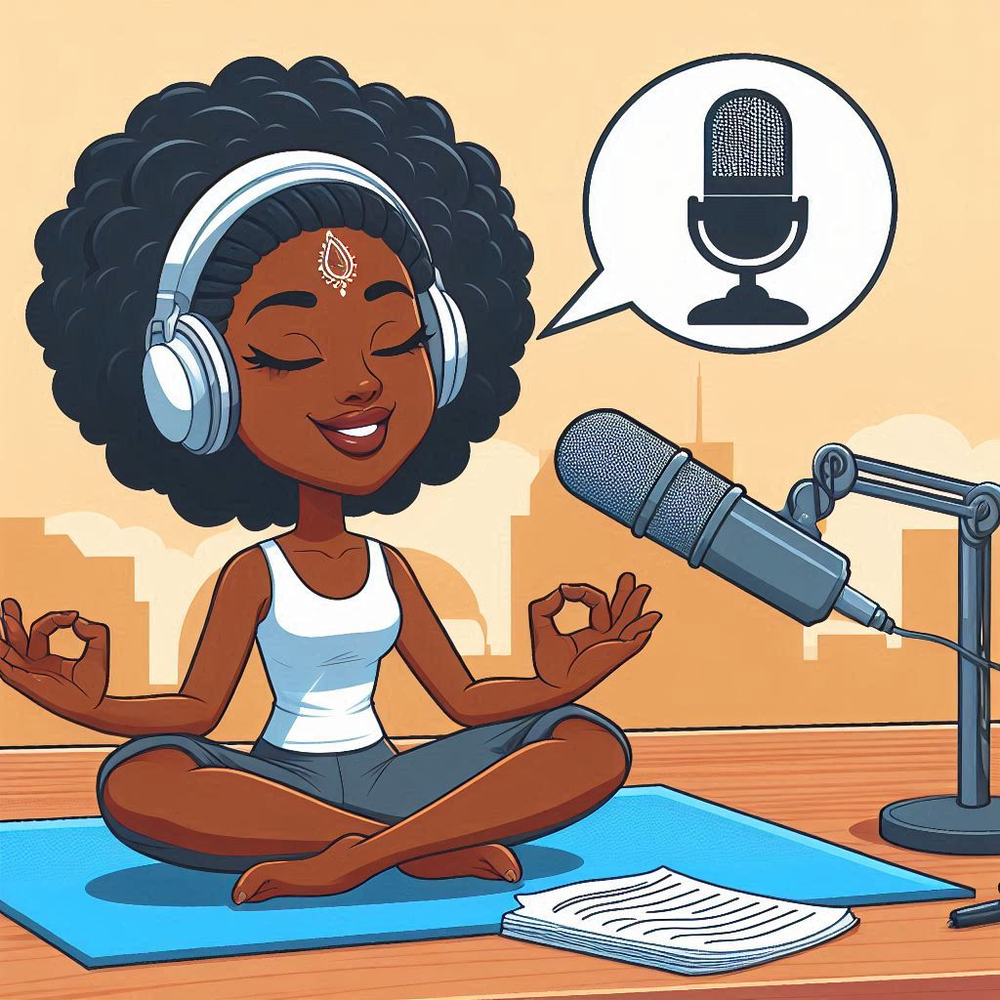

    preview do podcast

    <audio src="output/podcast_editado.MP3" controls title="Podcast editado"></audio>

# Desafio de Projeto Podcast Gerado por I.A.s - Meditaê

Projeto para entrega do Desafio de Projeto com o objetivo de gerar um Podcast digital com as facilidades das ferramentas de IA

## 💻 Tecnologias utilizadas no projeto

- ChatGPT
- ElevenLabs
- Clipchamp

## ✨ Como foi feito ?

- Roteiro gerado via chatgpt
- Audio gerado pela elevenLabs
- Copilot para gerar capas
- Clipchamp para tratar aúdio e adicionar sons de fundo
- Pixabay para música de fundo

## 📚 Materiais

- Aula DIO
- Editor de áudio

    
    
&nbsp&nbsp&nbspFelipe Aguiar 
    &nbsp&nbsp&nbsp
    <a 
        href="https://github.com/felipeAguiarCode">
        GitHub
    </a>
    &nbsp;|&nbsp;
    <a 
        href="www.linkedin.com/in/felipe-exe">
        LinkedIn
    </a>
    &nbsp;|&nbsp;
    <a 
        href="https://www.instagram.com/felipeaguiar.exe/">
        Instagram
    </a>
    &nbsp;|&nbsp;

  

---

⌨️ com 💜 por [Felipe Aguiar](https://github.com/felipeAguiarCode)
